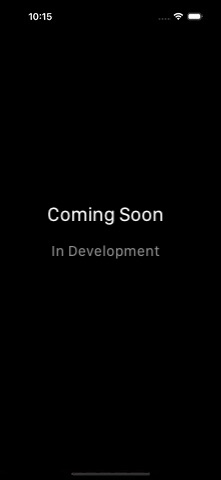

# SwiftUI New Metal Shaders + Scroll Capabilities 

<!--  -->

### If you like the project, please give it a star ⭐ It will show the creator your appreciation and help others to discover the repo.

# ✍️ About
🔮 SwiftUI 5 scroll view + animated SF Symbols + **NATIVE SHADERS**!

# 🪄 Features
- `ScrollView`: `scrollTargetBehavior`, `scrollBounceBehavior` and `scrollTransition`
- `containerRelativeFrame` and `visualEffect`
- Animated `SFSymbols`
- `TimelineView` with `distortionEffect` + `Shader`
  - The kaleidoscope effect is applied to a static SwiftUI image
  - The text's wave effect

# 📺 Demo
Please note that the `.gif` files have low frame rate due to compression and accessibility of demo.

|  |  |  |
:-------------------------:|:-------------------------:|:-------------------------:
 |  | 
 |  | 

# 👨‍💻 Author 
[Astemir Eleev](https://github.com/eleev)

# 🔖 Licence 
The project is available under [MIT Licence](https://github.com/eleev/swiftui-new-metal-shaders/blob/master/LICENSE)
